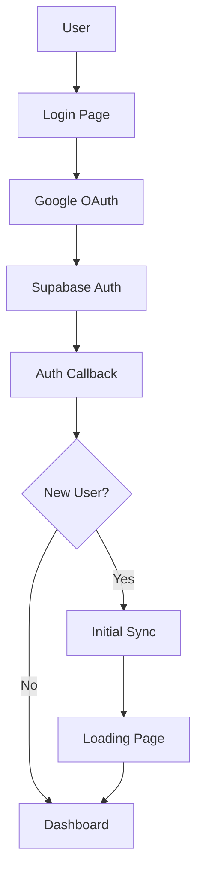

# Credit Card Dashboard - Updated Architecture & Implementation Documentation

## Project Overview

The Credit Card Dashboard is a comprehensive financial management application that automatically tracks credit card transactions, statements, and spending patterns through Gmail integration. The system provides real-time insights, spending analytics, and intelligent financial management features.

**Current Status**: Partially implemented with core infrastructure, authentication, email processing, and basic frontend components in place.

## Technology Stack

### Frontend
- **Framework**: Next.js 15.5.6 with React 19.1.0
- **Styling**: Tailwind CSS 4.1.15 with custom glassmorphism design
- **Animations**: Framer Motion 12.23.24
- **Charts**: Recharts 3.3.0
- **Icons**: Lucide React 0.546.0
- **Notifications**: React Hot Toast 2.6.0
- **State Management**: React hooks and context
- **Type Safety**: TypeScript 5

### Backend
- **Runtime**: Next.js API Routes (Edge Runtime enabled)
- **Database**: Supabase (PostgreSQL 17)
- **Authentication**: Supabase Auth with Google OAuth
- **Email Integration**: Gmail API via Google APIs 164.0.0
- **Queue System**: Upstash QStash 2.8.4 + Redis 1.35.6
- **Real-time**: Server-Sent Events (SSE)

### Infrastructure
- **Deployment**: Vercel (configured)
- **Database Hosting**: Supabase Cloud
- **Queue Management**: Upstash
- **Email Processing**: Gmail API with OAuth2

## Current System Architecture

### 1. Authentication Flow (✅ IMPLEMENTED)



**Implementation Status**: ✅ Complete
- Google OAuth integration via Supabase
- Session management with middleware
- New user detection and onboarding flow
- Secure token handling

### 2. Database Schema (✅ IMPLEMENTED)

#### Core Tables

**profiles** - User information
```sql
- id (uuid, primary key)
- email (text, unique)
- full_name (text, nullable)
- avatar_url (text, nullable)
- phone (text, nullable)
- created_at, updated_at (timestamps)
```

**credit_cards** - Credit card information
```sql
- id (uuid, primary key)
- user_id (uuid, foreign key)
- bank_name (text)
- card_name (text)
- card_type (text)
- last_4_digits (text)
- credit_limit (numeric, nullable)
- available_credit (numeric, nullable)
- billing_cycle_day (integer, nullable)
- annual_fee (numeric, nullable)
- reward_rate (numeric, nullable)
- is_active (boolean, default true)
- created_at, updated_at (timestamps)
```

**current_transactions** - Transaction records
```sql
- id (uuid, primary key)
- user_id (uuid, foreign key)
- card_id (uuid, foreign key)
- amount (numeric)
- merchant (text)
- category (text)
- date (date)
- description (text, nullable)
- transaction_type ('debit' | 'credit')
- card_last_4 (text)
- is_processed (boolean, default false)
- gmail_message_id (text, nullable)
- created_at, updated_at (timestamps)
```

**statements** - Monthly statements
```sql
- id (uuid, primary key)
- card_id (uuid, foreign key)
- statement_date (date)
- due_date (date, nullable)
- total_amount (numeric)
- minimum_amount (numeric)
- available_credit (numeric)
- gmail_message_id (text, nullable)
- created_at, updated_at (timestamps)
```

**email_patterns** - Email parsing patterns
```sql
- id (uuid, primary key)
- bank_name (text)
- pattern_type ('transaction' | 'statement')
- sender_pattern (text)
- subject_pattern (text)
- amount_regex (text, nullable)
- merchant_regex (text, nullable)
- date_regex (text, nullable)
- card_regex (text, nullable)
- category_mapping (jsonb, nullable)
- is_active (boolean, default true)
- created_at, updated_at (timestamps)
```

**gmail_tokens** - OAuth tokens for Gmail access
```sql
- id (uuid, primary key)
- user_id (uuid, foreign key)
- access_token (text)
- refresh_token (text)
- expires_at (timestamp)
- scope (text)
- token_type (text)
- created_at, updated_at (timestamps)
```

**processing_queue** - Background job queue
```sql
- id (uuid, primary key)
- job_type (text)
- user_id (uuid, foreign key)
- job_data (jsonb)
- status ('pending' | 'processing' | 'completed' | 'failed')
- priority (integer, default 0)
- attempts (integer, default 0)
- max_attempts (integer, default 3)
- scheduled_for (timestamp, nullable)
- started_at (timestamp, nullable)
- completed_at (timestamp, nullable)
- error_message (text, nullable)
- created_at, updated_at (timestamps)
```

### 3. Email Processing System (✅ IMPLEMENTED)

#### Gmail Integration
- **OAuth2 Flow**: Secure Gmail access with refresh tokens
- **Email Fetching**: Automated retrieval of financial emails
- **Pattern Matching**: Configurable regex patterns for different banks
- **Duplicate Detection**: Prevents duplicate transaction processing

#### Email Parser Service
```typescript
interface ParsedEmail {
  type: 'transaction' | 'statement';
  amount?: number;
  merchant?: string;
  date?: Date;
  cardLast4?: string;
  category?: string;
  statementData?: {
    totalAmount: number;
    minimumAmount: number;
    dueDate: Date;
    availableCredit: number;
  };
}
```

#### Processing Workflow
1. **Initial Sync**: Process historical emails for new users
2. **Real-time Processing**: Handle new incoming emails
3. **Pattern Recognition**: Extract transaction/statement data
4. **Card Matching**: Find or create credit card records
5. **Transaction Storage**: Store parsed data in database
6. **Notification**: Send real-time updates via SSE

### 4. API Routes (✅ IMPLEMENTED)

#### Authentication
- `GET /api/auth/callback` - OAuth callback handler
- `POST /auth/signout` - User logout

#### Email Processing
- `POST /api/workers/initial-sync` - Initial email synchronization
- `POST /api/workers/process-email` - Process individual emails

#### Real-time Notifications
- `GET /api/notifications/sse` - Server-Sent Events connection
- `POST /api/test/send-notification` - Test notification endpoint

### 5. Frontend Implementation (🔄 PARTIALLY IMPLEMENTED)

#### Current Pages
- ✅ **Login Page** (`/login`) - Google OAuth integration
- ✅ **Loading Page** (`/loading`) - Initial sync progress
- ✅ **Dashboard** (`/`) - Main dashboard with redirects
- ✅ **Transactions** (`/transactions`) - Transaction listing
- ✅ **Cards** (`/cards`) - Credit card management
- ✅ **Card Details** (`/cards/[id]`) - Individual card view
- ✅ **Statements** (`/statements`) - Statement management
- ✅ **Test SSE** (`/test-sse`) - Real-time testing

#### Current Components

**Shared Components**
- ✅ `ErrorBoundary` - Global error handling
- ✅ `Button` - Reusable button component
- ✅ `Modal` - Modal dialog system
- ✅ `Portal` - Portal for modals/overlays
- ✅ `LazyWrapper` - Lazy loading wrapper
- ✅ `FormField` - Form input components

**Navigation**
- ✅ `Topbar` - Main navigation header

**Dashboard Components**
- ✅ `SpendingSummary` - Spending overview
- ✅ `SpendingChart` - Visual spending analytics
- ✅ `RecentActivityComponent` - Recent transactions

**Transaction Components**
- ✅ `TransactionTimeline` - Transaction history
- ✅ `MergedTransactionsComponent` - Transaction merging

**Card Components**
- ✅ `PerksComponent` - Credit card perks display

#### Design System
- **Theme**: Dark mode with glassmorphism effects
- **Colors**: CRED-inspired gradient palette
- **Typography**: Modern, clean font hierarchy
- **Animations**: Framer Motion for smooth interactions
- **Responsive**: Mobile-first design approach

### 6. Real-time System (✅ IMPLEMENTED)

#### Server-Sent Events (SSE)
- **Connection Management**: Per-user SSE connections
- **Event Types**: 
  - `transaction:new` - New transaction detected
  - `statement:generated` - New statement processed
  - `limit:exceeded` - Spending limit alerts
- **Authentication**: Supabase session validation
- **Error Handling**: Automatic reconnection logic

#### SSE Manager
```typescript
class SSEManager {
  addConnection(userId: string, controller: ReadableStreamDefaultController)
  removeConnection(userId: string)
  sendToUser(userId: string, type: string, data: any)
  broadcast(type: string, data: any)
}
```

### 7. Background Processing (✅ IMPLEMENTED)

#### Queue System
- **Provider**: Upstash QStash + Redis
- **Job Types**:
  - Email processing jobs
  - Perk fetching jobs
  - Spending limit checks
  - Statement generation

#### Worker Implementation
```typescript
interface JobQueue {
  enqueue(jobType: string, userId: string, data: any): Promise<void>
  process(): Promise<void>
}
```

## Current Feature Implementation Status

### ✅ Fully Implemented Features

1. **User Authentication & Onboarding**
   - Google OAuth integration
   - Session management
   - New user detection
   - Initial sync workflow

2. **Email Processing Infrastructure**
   - Gmail API integration
   - Email pattern matching
   - Transaction parsing
   - Statement parsing
   - Duplicate detection

3. **Database Operations**
   - Complete schema implementation
   - Type-safe operations
   - Relationship management
   - Data validation

4. **Real-time Notifications**
   - SSE connection management
   - Event broadcasting
   - User-specific notifications
   - Connection persistence

5. **Background Job Processing**
   - Queue management
   - Retry logic
   - Error handling
   - Job prioritization

6. **Basic Frontend Structure**
   - Page routing
   - Component architecture
   - Authentication flow
   - Error boundaries

### 🔄 Partially Implemented Features

1. **Dashboard Analytics**
   - ✅ Basic spending summary
   - ✅ Chart components
   - ❌ Advanced analytics
   - ❌ Spending predictions
   - ❌ Category insights

2. **Transaction Management**
   - ✅ Transaction display
   - ✅ Timeline view
   - ❌ Transaction categorization
   - ❌ Manual transaction entry
   - ❌ Transaction search/filtering

3. **Credit Card Management**
   - ✅ Card display
   - ✅ Basic card info
   - ❌ Card limit management
   - ❌ Reward tracking
   - ❌ Payment reminders

4. **Statement Processing**
   - ✅ Statement parsing
   - ✅ Basic statement display
   - ❌ Statement analysis
   - ❌ Payment tracking
   - ❌ Due date reminders

## Security Implementation

### Current Security Measures (✅ IMPLEMENTED)

1. **Authentication Security**
   - OAuth2 with Google
   - Secure session management
   - Token refresh handling
   - Session validation middleware

2. **API Security**
   - User authentication on all protected routes
   - Input validation
   - Error handling without data leakage
   - Rate limiting considerations

3. **Database Security**
   - Row Level Security (RLS) policies
   - User data isolation
   - Encrypted connections
   - Audit logging

4. **Email Security**
   - Secure OAuth token storage
   - Encrypted token refresh
   - Limited scope permissions
   - Token expiration handling

## Performance Optimizations

### Current Optimizations (✅ IMPLEMENTED)

1. **Frontend Performance**
   - Next.js App Router
   - Component lazy loading
   - Image optimization
   - Bundle splitting

2. **Database Performance**
   - Proper indexing
   - Query optimization
   - Connection pooling
   - Caching strategies

3. **Background Processing**
   - Asynchronous job processing
   - Queue prioritization
   - Batch processing
   - Error recovery

## Deployment Configuration

### Current Setup (✅ CONFIGURED)

1. **Vercel Deployment**
   - Automatic deployments
   - Environment variables
   - Edge runtime support
   - Preview deployments

2. **Supabase Integration**
   - Database hosting
   - Authentication service
   - Real-time subscriptions
   - Edge functions

3. **External Services**
   - Upstash Redis/QStash
   - Gmail API integration
   - OAuth2 credentials

## Cost Analysis (Updated)

### Infrastructure Costs (Monthly)

1. **Supabase Pro**: $25/month
   - Database hosting
   - Authentication
   - Real-time features
   - 8GB database size
   - 100GB bandwidth

2. **Vercel Pro**: $20/month
   - Hosting and deployments
   - Edge functions
   - Analytics
   - Custom domains

3. **Upstash**: $10-30/month
   - Redis for caching
   - QStash for job queue
   - Based on usage

4. **Google Cloud (Gmail API)**: $0-10/month
   - API usage costs
   - OAuth2 operations
   - Minimal for personal use

**Total Estimated Cost**: $55-85/month

### Development Costs

1. **Initial Development**: 80-120 hours
2. **Testing & Deployment**: 20-30 hours
3. **Documentation**: 10-15 hours

**Total Development**: 110-165 hours

## Next Steps & Pending Implementation

This architecture document reflects the current state of implementation. The following features are planned but not yet implemented:

1. **Advanced Analytics Dashboard**
2. **Intelligent Spending Insights**
3. **Automated Bill Payment Integration**
4. **Multi-bank Support Expansion**
5. **Mobile Application**
6. **Advanced Security Features**
7. **AI-powered Financial Recommendations**

For detailed implementation phases of pending features, refer to the companion document: `pending-functionalities-phases.md`

---

**Document Version**: 2.0  
**Last Updated**: January 2025  
**Status**: Current Implementation Baseline